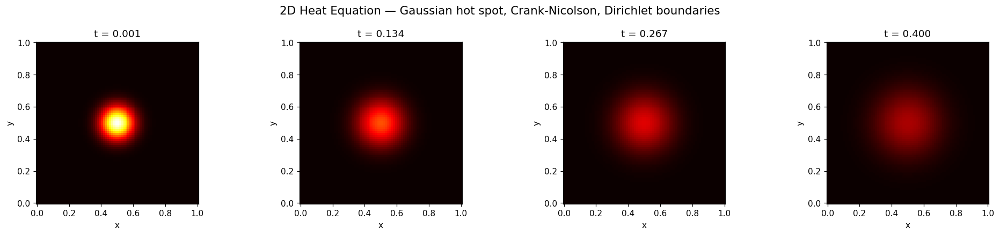
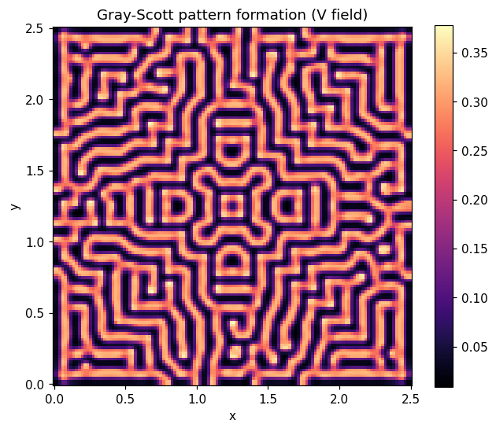

# 2D Heat & Reaction-Diffusion PDE Solver

Numerical PDE solver for the 2D heat equation and reaction-diffusion systems.
Implements **Explicit Euler** (FTCS) and **Crank-Nicolson** finite difference schemes,
with analytical validation, grid-convergence studies, and visualization.



*Gaussian hot spot cooling under zero-Dirichlet boundaries (Crank-Nicolson).*

## Interactive App

An interactive [Streamlit](https://streamlit.io) app lets you explore the solver
in the browser — drag a time slider through the diffusion, compare Explicit
Euler against Crank-Nicolson (and watch Euler blow up past the CFL limit),
check the numerical result against the analytical solution, and tune Gray-Scott
parameters to grow Turing patterns.

**Live demo:** _add your Streamlit Cloud URL here after deploying_

Run it locally:

```bash
pip install -r requirements.txt
streamlit run streamlit_app.py
```

## Features

- **2D Heat Equation** — Dirichlet, Neumann (zero-flux), and Periodic boundary conditions, configurable diffusivity
- **Explicit Euler** — Forward-Time Central-Space (FTCS), conditionally stable, emits a warning when the CFL limit (rx + ry ≤ 0.5) is exceeded
- **Crank-Nicolson** — Implicit, unconditionally stable, second-order in space and time. Boundary conditions are encoded directly in the sparse system matrix (Dirichlet pinned, Neumann via the ghost-node method, periodic edges tied together), so the BC is enforced inside the implicit solve. Matrix is rebuilt only when `dt` changes.
- **Reaction-Diffusion** — Fisher-KPP (traveling wave) and Gray-Scott (pattern formation) via Strang operator splitting
- **Analytical Validation** — Sinusoidal IC with known closed-form solution; RMSE, max, and relative L2 error metrics (zero-denominator guarded)
- **Visualization** — Static heatmaps, animated GIFs, log-log grid-convergence plots
- **CLI** — Full `argparse` interface for solve / validate / convergence workflows
- **Tested** — 30 tests covering boundary conditions, stability, accuracy, heat conservation, reaction-diffusion, and analytics

## Quick Start

```bash
uv sync                              # Create venv + install deps
```

Run:

```bash
uv run python main.py --solver cn --nx 50 --ic sin --validate
uv run python main.py --solver cn --bc neumann --ic gaussian --save heat.gif
uv run python main.py --solver reaction --reaction gray-scott --nx 80 --t-total 5.0
uv run python main.py --solver cn --convergence
```

## Validation Results

Crank-Nicolson validated against the closed-form solution for a
`sin(πx)·sin(πy)` initial condition decaying under zero-Dirichlet boundaries
(α = 0.01, t = 0.1):

| Grid | dt | Relative L2 error |
|---|---|---|
| 50 × 50 | 0.002 | 0.0007 % |
| 60 × 60 | 0.002 | 0.0005 % |
| 100 × 100 | 0.001 | 0.0002 % |

**Grid convergence** (CN, dt = 0.002) — L2 error vs the analytical solution:

| Grid | L2 error | Error ratio |
|---|---|---|
| 20 × 20 | 2.09 × 10⁻⁵ | — |
| 40 × 40 | 5.10 × 10⁻⁶ | 4.10× |
| 60 × 60 | 2.25 × 10⁻⁶ | 2.27× |
| 80 × 80 | 1.26 × 10⁻⁶ | 1.79× |

The ~4× error drop when the grid doubles (20→40) confirms the expected
second-order spatial convergence. Explicit Euler matches Crank-Nicolson at
small time steps and blows up predictably once the CFL limit is exceeded.

**Heat conservation (Neumann).** In an insulated all-Neumann box, total heat is
conserved to round-off (drift < 10⁻⁶ %) when measured with trapezoidal weights,
since boundary nodes represent half a control volume and corners a quarter. The
field correctly relaxes toward its uniform mean.

## Reaction-Diffusion



*Gray-Scott pattern formation (V field, F = 0.037, k = 0.06) — Turing-type labyrinth.*

> **Note on stability:** the reaction-diffusion solver uses explicit diffusion
> sub-steps, so it is subject to the same CFL limit as Explicit Euler
> (`D · (dt/2) / dx² · 2 ≤ 0.5` per the half-step splitting). Choose `dt`,
> grid spacing, and diffusion coefficients accordingly; overly large values
> will cause the solution to blow up.

## CLI Reference

| Flag | Default | Description |
|---|---|---|
| `--solver` | `cn` | `euler`, `cn`, or `reaction` |
| `--nx`, `--ny` | 50 | Grid points |
| `--Lx`, `--Ly` | 1.0 | Domain size |
| `--alpha` | 0.01 | Thermal diffusivity |
| `--dt` | 0.001 | Time step |
| `--t-total` | 0.1 | Total simulation time |
| `--ic` | `sin` | `sin` or `gaussian` |
| `--bc` | `dirichlet` | `dirichlet` or `neumann` |
| `--bc-val` | 0.0 | Dirichlet boundary value |
| `--validate` | off | Compare vs analytical solution |
| `--convergence` | off | Run grid convergence study |
| `--save` | None | Save output (`*.png` or `*.gif`) |
| `--reaction` | `fisher` | `fisher` or `gray-scott` |
| `--r` | 1.0 | Fisher-KPP growth rate |
| `--F` | 0.04 | Gray-Scott feed rate |
| `--k` | 0.06 | Gray-Scott kill rate |
| `--D` | 0.001 | Diffusion coeff (reaction) |
| `--Du` | 0.001 | Gray-Scott U diffusivity |
| `--Dv` | 0.0005 | Gray-Scott V diffusivity |
| `--no-display` | off | Headless mode |

## Numerical Methods

- **Discretization.** Second-order central differences in space; the heat
  equation `∂u/∂t = α∇²u` is advanced with FTCS (explicit) or Crank-Nicolson
  (implicit trapezoidal in time).
- **CFL condition.** FTCS is stable only when `rx + ry ≤ 0.5`, where
  `rx = α·dt/dx²` and `ry = α·dt/dy²`. Crank-Nicolson is unconditionally stable.
- **Boundary conditions** (Crank-Nicolson) are built into the system matrix:
  Dirichlet rows are pinned to the prescribed value via the RHS vector;
  Neumann (zero-flux) walls use the ghost-node method, mirroring the interior
  neighbour so the second-order stencil and heat conservation are preserved;
  periodic edges are tied to the opposite interior row.
- **Operator splitting.** Reaction-diffusion uses Strang splitting: a half
  diffusion step, a full reaction step, then a half diffusion step.

## Project Structure

```
Numerical solver/
├── assets/                  # Rendered figures and animations
├── src/
│   ├── __init__.py          # Public API exports
│   ├── _types.py            # Shared ICFunc type alias
│   ├── boundary.py          # BCType, BCConfig, apply_boundary
│   ├── solvers.py           # explicit_diffusion_step, ExplicitEuler2D, CrankNicolson2D
│   ├── reaction.py          # ReactionDiffusionSolver (Fisher-KPP, Gray-Scott)
│   ├── analytics.py         # Analytical solutions, error metrics
│   └── visualization.py     # Heatmaps, animations, convergence plots
├── tests/
│   ├── __init__.py
│   └── test_solvers.py      # 30 tests: boundary, stability, accuracy, conservation, reaction, integration
├── notebooks/
│   └── demo.ipynb           # Interactive demo notebook
├── main.py                  # CLI entry point
├── pyproject.toml           # Project metadata, pyright + ruff config
└── README.md
```

## Development

```bash
uv sync --dev                      # Install including pytest, jupyter
uv run pytest                      # 30 tests
uv run ruff check src/ main.py tests/
```

## Requirements

- Python >= 3.12
- numpy >= 2.0, scipy >= 1.14, matplotlib >= 3.9
- pytest >= 8.0, jupyter >= 1.1 (dev)
